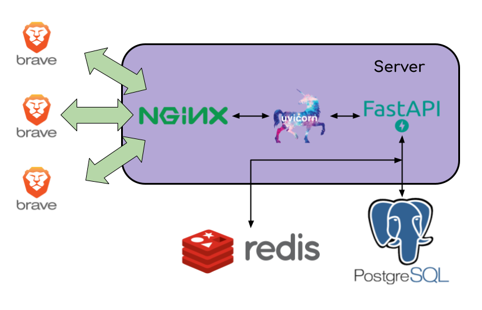

<p align="center">
    <a href="https://github.com/nickatnight/fastapi-backend-base/actions">
        
    </a>
    <a href="https://github.com/nickatnight/fastapi-backend-base/releases"></a>
</p>


# fastapi-backend-base

Small base project I use to build and deploy fastapi backends..batteries included. Basically a stripped down version of [this](https://github.com/tiangolo/full-stack-fastapi-postgresql) and [this](https://github.com/jonra1993/fastapi-alembic-sqlmodel-async) repo...with some extra bells and whistles.

## Features
* **Docker Compose** integration and optimization for local development.
* **Production ready** Python web server using Uvicorn
* Python <a href="https://github.com/tiangolo/fastapi" class="external-link" target="_blank">**FastAPI**</a> backend:
    * **Fast**: Very high performance, on par with **NodeJS** and **Go** (thanks to Starlette and Pydantic).
    * **Intuitive**: Great editor support. <abbr title="also known as auto-complete, autocompletion, IntelliSense">Completion</abbr> everywhere. Less time debugging.
    * **Easy**: Designed to be easy to use and learn. Less time reading docs.
    * **Short**: Minimize code duplication. Multiple features from each parameter declaration.
    * **Robust**: Get production-ready code. With automatic interactive documentation.
    * **Standards-based**: Based on (and fully compatible with) the open standards for APIs: <a href="https://github.com/OAI/OpenAPI-Specification" class="external-link" target="_blank">OpenAPI</a> and <a href="http://json-schema.org/" class="external-link" target="_blank">JSON Schema</a>.
    * <a href="https://fastapi.tiangolo.com/features/" class="external-link" target="_blank">**Many other features**</a> including automatic validation, serialization, interactive documentation, authentication with OAuth2 JWT tokens, etc.
* **SQLModel** Library for interacting with SQL databases from Python code, with Python objects. It is designed to be intuitive, easy to use, highly compatible, and robust
* **CORS** (Cross Origin Resource Sharing).
* **NGINX** High Performance Load Balancer, Web Server, & Reverse Proxy
* **Let's Encrypt** A free, automated, and open certificate authority (CA), provided by the Internet Security Research Group (ISRG)...with automatic cert renewal.
* **PostgresSQL** Powerfull open source object-relational database
* **AsyncPG** Database interface library designed specifically for PostgreSQL and Python/asyncio.
* **Redis** In-memory data structure store, used as a distributed, in-memory key–value database, cache and message broker.

<p align="center">
    <a href="#">
        
    </a>
</p>

## Usage
1. `git clone https://github.com/nickatnight/fastapi-backend-base.git`
2. `cd fastapi-backend-base`
3. `mv .env_example .env`
4. `docker compose up --build`
5. visit `http://localhost:8666/v1/openapi.json` for uvicorn server, or `http://localhost` for nginx proxy

## Nginx
```yml
volumes:
  proxydata-vol:
...
proxy:
    image: your-registry/proxy # OR
    build:
      context: ./proxy
      dockerfile: ./Dockerfile
    environment:
      - UPSTREAMS=/:backend:8000
      - NGINX_SERVER_NAME=yourservername.com
      - ENABLE_SSL=true
      - HTTPS_REDIRECT=true
      - CERTBOT_EMAIL=youremail@gmail.com
      - DOMAIN_LIST=yourservername.com
    ports:
      - '0.0.0.0:80:80'
      - '0.0.0.0:443:443'
    volumes:
      - proxydata-vol:/etc/letsencrypt
```

Some of the envrionment variables available:
- `UPSTREAMS=/:backend:8000` a comma separated list of \<path\>:\<upstream\>:\<port\>.  Each of those of those elements creates a location block with proxy_pass in it.
- `HTTPS_REDIRECT=true` enabled a standard, ELB compliant https redirect.
- `ENABLE_SSL=true` to enable redirects to https from http
- `NGINX_SERVER_NAME` name of the server and used as path name to store ssl fullchain and privkey
- `CERTBOT_EMAIL=youremail@gmail.com` the email to register with Certbot.
- `DOMAIN_LIST` domain(s) you are requesting a certificate for.

When SSL is enabled, server will install Cerbot in standalone mode and add a new daily periodic script to `/etc/periodic/daily/` to run a cronjob in the background. This allows you to automate cert renewing (every 3 months). See [docker-entrypoint](proxy/docker-entrypoint.sh) for details.


## Deploy
A common scenario is to use an orchestration tool, such as docker swarm, to deploy your containers to the cloud (DigitalOcean).
